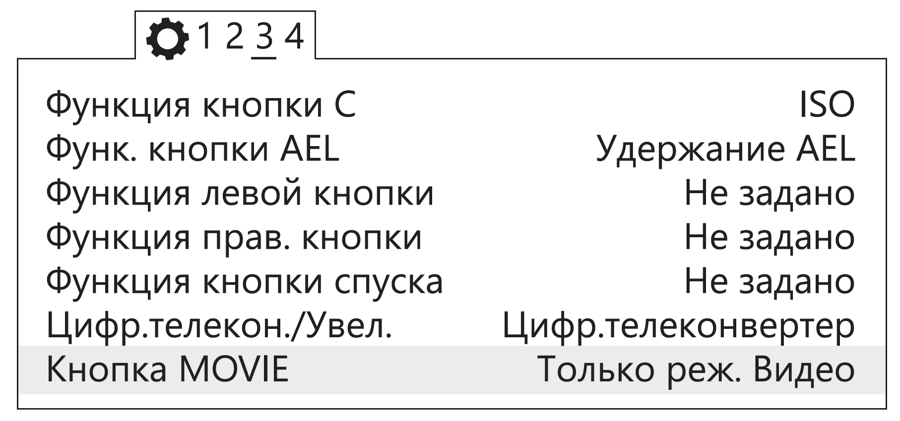
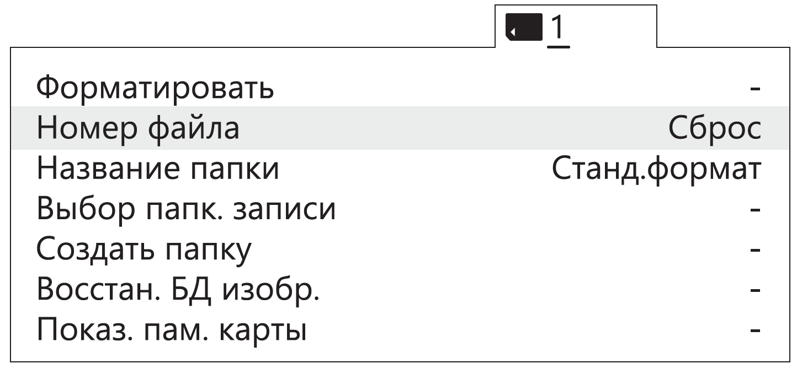
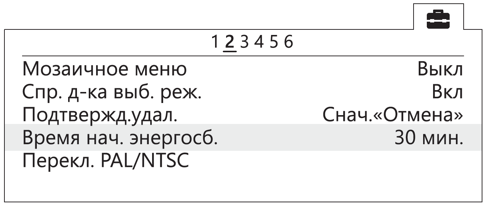
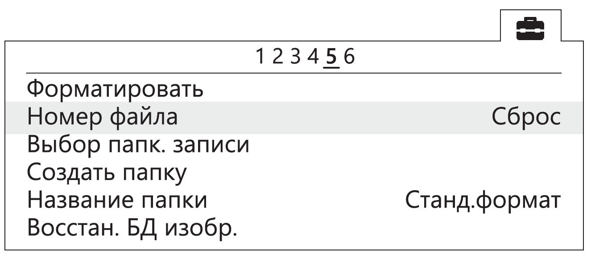

Настройка фотоаппарата
=========================

Настройка фотоаппарата Sony DSC-RX1
------------------------------------------

Перед изменением настроек ознакомьтесь с инструкцией по эксплуатации фотоаппарата, в которой описано назначение и использование органов управления.

* Установите диск режимов  в положение **S** (Приоритет выдержки).
* Установите выдержку **1/800**.
* Диск коррекции экспозиции установите в положение **0** (ноль).
* Кольцо переключения макро установите в положение **0,3m-∞**.
* Диск режима фокусировки установите в положение **MF**.

Для настройки параметров фотоаппарата нужно нажать кнопку **MENU**, затем, в соответствии с пунктами ниже, установить требуемые значения.

* В меню фотосъемки (вкладка 1) установите **Размер изображения** - **L24M**, **Формат** - **3:2**, **Качество** – **Высокое**.

   Установка параметров съемки

* В меню пользовательских установок (вкладка 1) отключите **Автоматический просмотр**.

.. figure:: _static/_images/menu2.png
   :width: 400
   :align: center

   Отключение автоматического просмотра

* Отключите **Помощь для РФ** и установите **Время увеличения фокусировки** - **Без ограничений** (вкладка 2).

.. figure:: _static/_images/menu13.png
   :width: 400
   :align: center

   Отключение помощи для РФ и установка времени увеличения фокусировки

* Установите для кнопки **MOVIE** - **Только режим видео** (вкладка 3).

   Установка значения «Только режим видео»

* В меню (вкладка 2) установите **Время начала энергосбережения** - **30 мин** .

.. figure:: _static/_images/menu1.png
   :width: 400
   :align: center

   Установка времени начала энергосбережения

* В меню карты памяти установите **Номер файла** - **Сброс**.

   Сброс номера файла

Другие настройки изменять не требуется, эти параметры устанавливаются по умолчанию. Если необходимо **СБРОСИТЬ все настройки и параметры** фотоаппарата и повторной настройки, зайдите в **MENU** → **Меню установки**→ **ИНИЦИАЛИЗАЦИЯ** → **Сброс настроек**. После перезагрузки фотоаппарата необходимо произвести выбор **Часового пояса и даты**, в противном случае настройки не сохранятся и при включении фотоаппарата будет повторно появляться меню настройки Часового пояса и даты. После установки Часового пояса и даты необходимо произвести настройку параметров как указано выше.

По окончании настройки необходимо ШТАТНО (через переключатель ON/OFF) выключить фотоаппарат, и не отключать от источника питания в течении 3 минут (это время необходимо для сохранения всех настроек в память фотоаппарата). 

Фотоаппарат может выводить на экран сообщение «E:61:00». Это связано с тем, что фотоаппарат принудительно сфокусирован на бесконечность. **Наличие сообщения «E:61:00» не влияет на работоспособность фотоаппарата**.

Настройка фотоаппарата Sony А6000
------------------------------------

Перед выполнением настроек ознакомьтесь с инструкцией по эксплуатации фотоаппарата, в которой описано назначение и использование органов управления.

* Диск режимов установите в положение **S** (Приоритет выдержки).

С помощью диска управления установите следующие параметры:

.. csv-table:: 
   
   "выдержка", "1/800"
   "ISO", "Auto"

* В меню фотосъемки (вкладка 2) установите **Режим фокусировки** - **Ручной фокус**.

.. figure:: _static/_images/menu4.png
   :align: center
   :width: 400

   Установка ручного фокуса для режима фокусировки

* В меню пользовательских установок (вкладка 1) отключите **Автоматический просмотр**.

.. figure:: _static/_images/menu5.png
   :align: center
   :width: 400

   Отключение автоматического просмотра

* В меню пользовательских установок (вкладка 3) включите **Cпуск без объектива**.

   Включение спуска без объектива

* В меню пользовательских установок (вкладка 6) установите для кнопки **MOVIE** - **Только режим видео**.

.. figure:: _static/_images/menu7.png
   :align: center
   :width: 400

   Установка значения «Только режим видео»

* В меню (вкладка 2) установите **Время начала энергосбережения** - **30 мин**.

   Установка времени начала энергосбережения

* В меню (вкладка 5) установите **Номер файла** - **Сброс**.

   Сброс номера файла

Настройка фотоаппарата Sony A6000 NIR
-----------------------------------------

В меню фотосъемки установите следующие параметры:

* **Качество** - **RAW** в меню фотосъемки (Вкладка 1);

.. figure:: _static/_images/menunir.png
   :align: center
   :width: 400

   Установка качества

* **ISO** не более 400 (Для настройки нажать колесико управления вправо);

* **Коррекция экспозиции** от EV +1 до EV +2 (Для настройки нажмите колесико управления вниз).