Катапульта
==============

Узлы, детали и принадлежности
--------------------

* Резиновые жгуты
* Каретка
* Передняя часть катапульты
* Средняя часть – удлинитель катапульты
* Средняя часть катапульты с лебедкой
* Задняя часть катапульты
* Комплект резиновых жгутов для катапульты
* Ручка лебедки
* Кол

Сборка
----------

.. figure:: _static/_images/catapult0.jpg
   :align: center
   :width: 400

   Извлеките детали катапульты из транспортировочного чехла.  

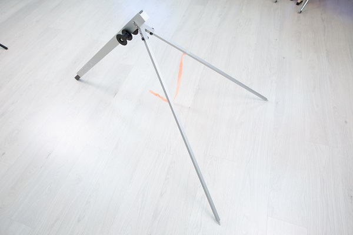
   Разложите опорные стойки. Убедитесь, что они надежно закреплены защелками.

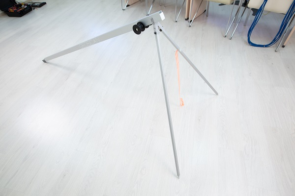

   Присоедините среднюю часть-удлинитель к передней части катапульты

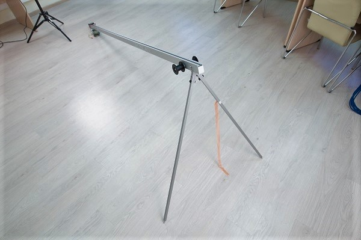
   Присоедините среднюю часть катапульты с лебедкой.

.. figure:: _static/_images/catapult4.jpg
   :align: center
   :width: 400
   :alt: Рис. (со стр. 26, правый)

   Разложите опорные стойки задней части катапульты.

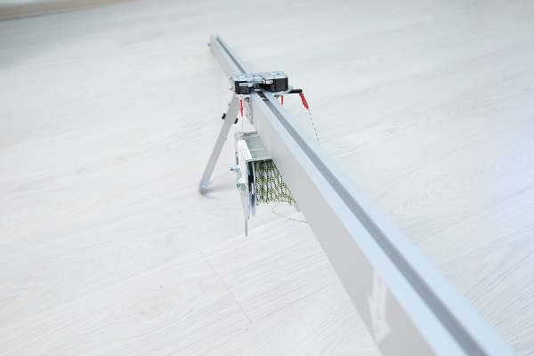

   Присоедините заднюю часть катапульты.

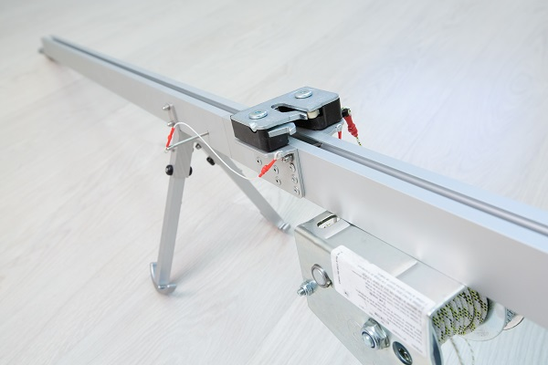
   Вставьте фиксирующий штифт в отверстие в соединении средней и задней частей катапульты.

.. attention:: Запуск БВС разрешен строго против ветра. Категорически запрещается производить запуск БВС по ветру. Невыполнение данного требования может привезти к падению БВС или к столкновению его с препятствиями, поскольку БВС не сможет набрать высоту. В штилевых условиях добавьте на каждую сторону дополнительный виток резиновых жгутов из комплекта ЗИП.

* Установите катапульту на ровной поверхности так, чтобы запуск БВС происходил против ветра.

* Убедитесь, что катапульта устойчиво стоит на земле, а ее направляющая не имеет крена. При необходимости заглубите одну из опор для выравнивания конструкции 

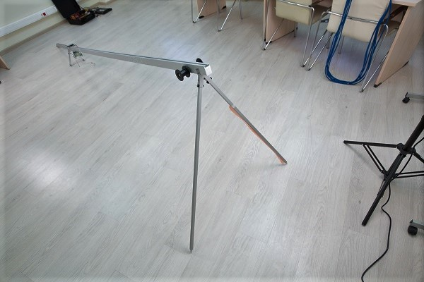

   Установите и забейте упорный кол, чтобы предотвратить смещение катапульты при запуске БВС.

.. attention:: При запуске БВС рывок резиновых жгутов приводит к подбрасыванию задней части катапульты. Чтобы надежно закрепить катапульту, забивайте кол на всю длину, добиваясь полной неподвижности задних опорных стоек катапульты. Забивая кол, следите за тем, чтобы не деформировать заднюю часть катапульты.

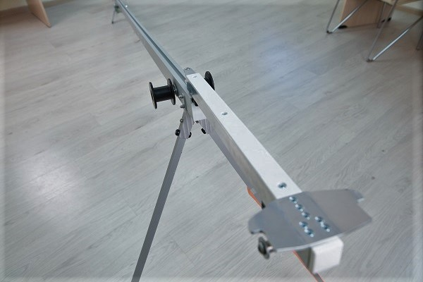

   Установите каретку на направляющую катапульты со стороны передней части так, чтобы направляющие каретки скользили по рельсам 

* Прокатите каретку по рельсам вниз до ее фиксации в замке (должно быть два щелчка)

.. note:: Убедитесь, что каретка свободно скользит по рельсам, не цепляясь на стыках частей катапульты. Осуществляйте проверку свободного движения каретки перед каждым запуском БВС.

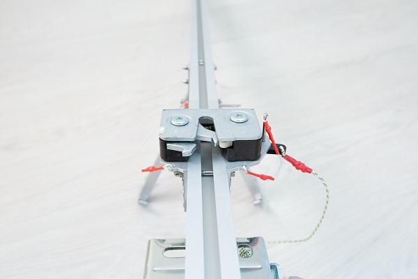

   Вставьте предохранительный штифт в пусковой механизм

   Отпустите стопор лебедки и размотайте натяжной трос.

* Возьмите резиновые жгуты, расправьте кольца, убедитесь, что жгуты не перехлестнуты 

 
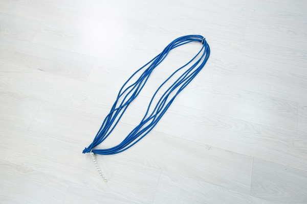

   Сложите кольца резиновых жгутов так, чтобы на одной стороне находился карабин, а на второй кольцо из синтетического троса 

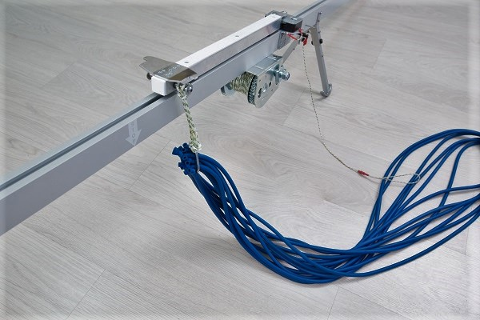

   Из кольца сделайте петлю и зацепите каретку 

.. figure:: _static/_images/catapult19.jpg
   :align: center
   :width: 400

   Второй конец резинового жгута соедините с концом натяжного троса с помощью карабина. Натяжной трос должен проходить через ролик. Карабин обязательно должен быть замуфтован 

* Аналогично присоедините второй резиновый жгут

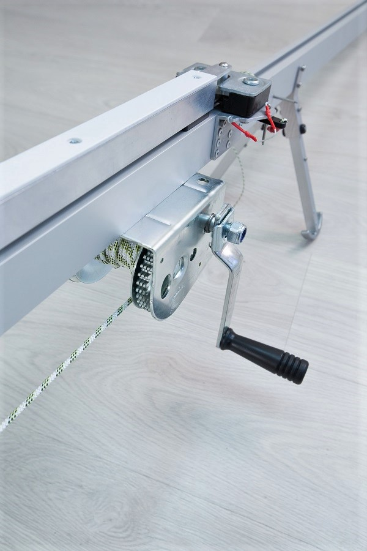
   Установите ручку лебедки и закрепите ее гайкой.

* Регулярно проверяйте состояние резиновых жгутов. При обнаружении трещин и потертостей замените поврежденное кольцо на запасное из комплекта ЗИП
* Не держите резиновые жгуты в натянутом состоянии длительное время. Натягивайте жгуты непосредственно перед установкой БВС на катапульту
* После запуска БВС ослабьте резиновые жгуты. Для этого,  придерживая ручку лебедки одной рукой, другой рукой отпустите стопор лебедки и плавно разматывайте натяжной трос.
* После чего можно снять жгуты с катапульты, отсоединив карабин от троса и петлю от каретки
* В теплое время года не допускайте длительного нахождения резиновых жгутов под прямыми солнечными лучами
* В холодное время года резиновые жгуты следует хранить в теплом месте,  устанавливать на катапульту непосредственно перед запуском БВС, снимать с катапульты и убирать в теплое место сразу после запуска БВС.

Подготовка катапульты к запуску БВС
--------------------------------------

.. attention:: В целях обеспечения безопасности работ на стартовой площадке и увеличения ресурса резиновых жгутов, натягивайте жгуты непосредственно перед стартом, после успешного проведения предстартовой подготовки.

.. figure:: _static/_images/catapult14.jpg
   :align: center
   :width: 400
   :alt: Рис. Хорошо бы картинку, показывающую, как переключать стопор.

   Переведите стопор лебедки в положение для натяжения троса.

Вращая ручку лебедки, натяните резиновые жгуты. Особое внимание следует обратить на карабины во время прохождения их через ролики. При попадании жгута между роликом и направляющей катапульты или срыве с ролика, необходимо прекратить натяжение жгутов. Сорвавшийся жгут нужно уложить на ролик, после чего можно продолжить взводить катапульту. 

Натяжение необходимо прекратить, когда карабины, за которые зацеплены жгуты, будут напротив мартера "STOP", выгравированного на пусковой части катапульты. 

Теперь БПЛА может быть установлен накатапульту.

.. attention:: При установке БПЛА на катапульту проверьте, что резиновый жгут складывает воздушный винт, а лопасти винта направлены параллельно крылу.

Правила обращения с резиновыми жгутами
--------------------------------------

* Регулярно проверяйте состояние резиновых жгутов. При обнаружении трещин и потертостей, замените паврежденное кольцо на запасное из комплекта ЗИП
* Не держите резиновые жгуты в натянутом состоянии длителное время. Натягивайте жгуты непосредственно пере установкой БПЛА на катапульту
* После запуска БПЛА снимите резиновый жгут с поворотных роликов. Для этого одной рукой придерживая ручку лебедки, второй снимите стопор лебедки, и плавно разматывайте натяжной трос. После этого можно снять жгуты с катапульты, отсоединив карабин от троса и петлю от каретки. 
* В теплое время года не допускайте длительного нахождения резиновых жгутов под прямыми солнечными лучами. 
* В холодное время года не допускайте замерзания резинового жгута. Держите его в теплом месте до установки на катапуьлту и натягивайте непосредственно перед запуском. После запуска БПЛА немедленно снимите жгты с катапульты и уберите в теплое место. 
  
