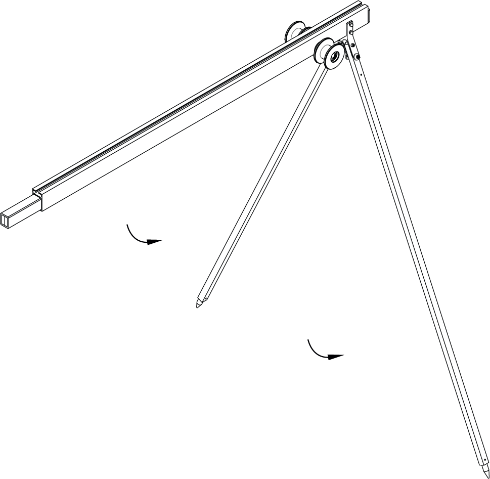
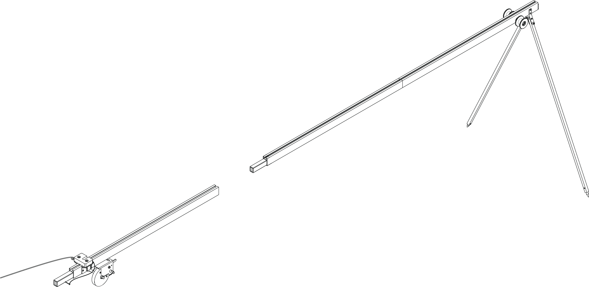
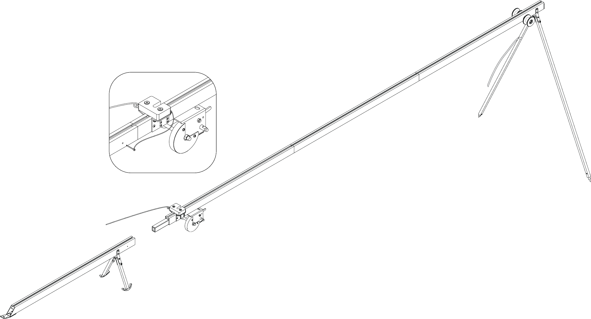
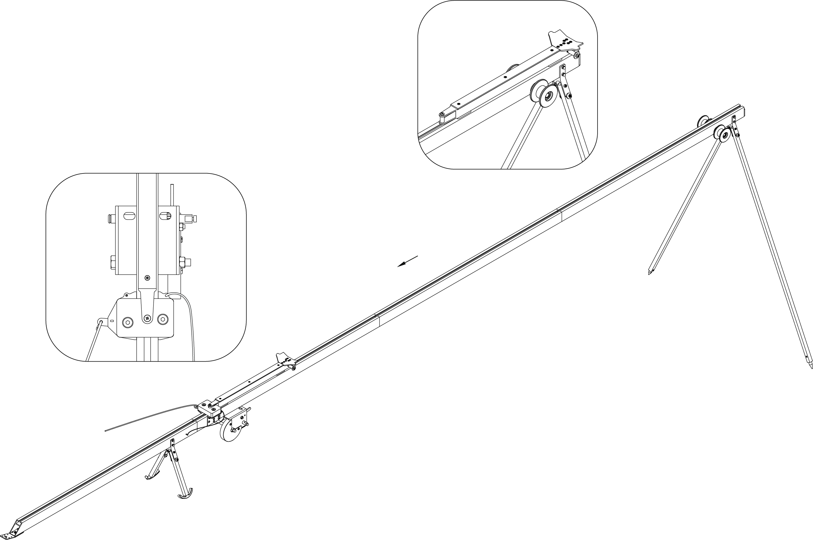
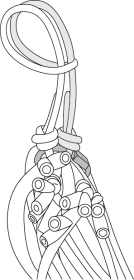

Катапульта
==============

Узлы и детали
--------------------

**Для катапульты отсутствуют картинки:**
*Надо поменять порядок картинок (переставить стр. 24 и 25 из PDF)*

* Резиновые жгуты
* Колышек
* Молоток
* Каретка
* Передняя часть катапульты
* Средняя часть – удлинитель катапульты
* Средняя часть катапульты с лебедкой
* Задняя часть катапульты
* Комплект резиновых жгутов для катапульты
* Ручка лебедки
* Кол
* Молоток

Сборка
----------

* Извлеките детали катапульты из транспортировочного чехла.  

* Разложите опорные стойки. Убедитесь, что они надежно закреплены защелками.

   Присоедините среднюю часть катапульты – удлинитель.
   Присоедините среднюю часть катапульты с лебедкой.

.. figure:: _static/_images/catapult2.png
   :align: center
   :width: 400
   :alt: Рис. (со стр. 26, правый)

   Разложите опорные стойки задней части катапульты.

   Присоедините заднюю часть катапульты.
   Вставьте фиксирующий штифт в отверстие в соединении средней и задней частей катапульты.

.. figure:: _static/_images/catapult4.png
   :align: center
   :width: 400
   :alt: Рис. (за основу взять рис. со стр. 27, правый, врезку поменять!)

.. attetion:: Запуск БВС разрешен строго против ветра. Категорически запрещается производить запуск БВС по ветру. Невыполнение данного требования может привезти к падению БВС или к столкновению его с препятствиями, поскольку БВС не сможет набрать высоту. В штилевых условиях добавьте на каждую сторону дополнительный виток резиновых жгутов из комплекта ЗИП.

* Установите катапульту на ровной поверхности так, чтобы запуск БВС происходил против ветра.

* Убедитесь, что катапульта устойчиво стоит на земле, а ее направляющая не имеет крена. При необходимости заглубите одну из опор для выравнивания конструкции 

* Установите и забейте упорный колышек, чтобы предотвратить смещение катапульты при запуске БВС.

.. figure:: _static/_images/catapult5.png
   :align: center
   :width: 400
   :alt: Рис.  (Забивание упорного колышка)

.. attention:: При запуске БВС рывок резиновых жгутов приводит к подбрасыванию задней части катапульты. Чтобы надежно закрепить катапульту, забивайте колышек на всю длину, добиваясь полной неподвижности задних опорных стоек катапульты. Забивая колышек, следите за тем, чтобы не деформировать заднюю часть катапульты.

* Установите каретку на направляющую катапульты со стороны передней части так, чтобы направляющие каретки скользили по рельсам 

   Прокатите каретку по рельсам вниз до ее фиксации в замке (должно быть два щелчка)

.. note:: Убедитесь, что каретка свободно скользит по рельсам, не цепляясь на стыках частей катапульты. Осуществляйте проверку свободного движения каретки перед каждым запуском БВС.

.. figure:: _static/_images/catapult7.png
   :align: center
   :width: 400
   :alt: Рис.

   Вставьте предохранительный штифт в пусковой механизм

.. figure:: _static/_images/catapult8.png
   :align: center
   :width: 400
   :alt: Рис. 

   Отпустите стопор лебедки и размотайте натяжной трос.

* Возьмите резиновые жгуты, расправьте кольца, убедитесь, что жгуты не перехлестнуты 
* Сложите кольца резиновых жгутов так, чтобы на одной стороне находился карабин, а на второй кольцо из синтетического троса 
 

   
   Из кольца сделайте петлю и зацепите каретку

* Второй конец резинового жгута соедините с концом натяжного троса с помощью карабина. Натяжной трос должен проходить через ролик. Карабин обязательно должен быть замуфтован 
Аналогично присоедините второй резиновый жгут

* Установите ручку лебедки и закрепите ее гайкой-барашком.

** В комплекте со склада на оси катапульты была обычная гайка. Это всегда так (чтобы шайба не терялась) или случайно?**

.. figure:: _static/_images/catapult11.png
   :align: center
   :width: 400
   :alt: Рис. (по мотивам картинки со стр. 28 PDF, только убрать лишнее, показать ручку, шайбу и гайку-барашек)

* Регулярно проверяйте состояние резиновых жгутов. При обнаружении трещин и потертостей замените поврежденное кольцо на запасное из комплекта ЗИП
* Не держите резиновые жгуты в натянутом состоянии длительное время. Натягивайте жгуты непосредственно перед установкой БВС на катапульту
* После запуска БВС ослабьте резиновые жгуты. Для этого,  придерживая ручку лебедки одной рукой, другой рукой отпустите стопор лебедки и плавно разматывайте натяжной трос.
* После чего можно снять жгуты с катапульты, отсоединив карабин от троса и петлю от каретки
* В теплое время года не допускайте длительного нахождения резиновых жгутов под прямыми солнечными лучами
* В холодное время года резиновые жгуты следует хранить в теплом месте,  устанавливать на катапульту непосредственно перед запуском БВС, снимать с катапульты и убирать в теплое место сразу после запуска БВС.

Подготовка катапульты к запуску БВС
--------------------------------------

.. attention:: В целях обеспечения безопасности работ на стартовой площадке и увеличения ресурса резиновых жгутов, натягивайте жгуты непосредственно перед стартом, после успешного проведения предстартовой подготовки.

* Переведите стопор лебедки в положение для натяжения троса.

.. figure:: _static/_images/catapult11.png
   :align: center
   :width: 400
   :alt: Рис. Хорошо бы картинку, показывающую, как переключать стопор.

   Вращая ручку лебедки, натяните резиновые жгуты. Особое внимание следует обратить на карабины во время прохождения их через ролики. При попадании жгута между роликом и направляющей катапульты или срыве с ролика, необходимо прекратить натяжение жгутов. Сорвавшийся жгут нужно руками уложить на ролик, после чего можно продолжить взводить катапульту. 

