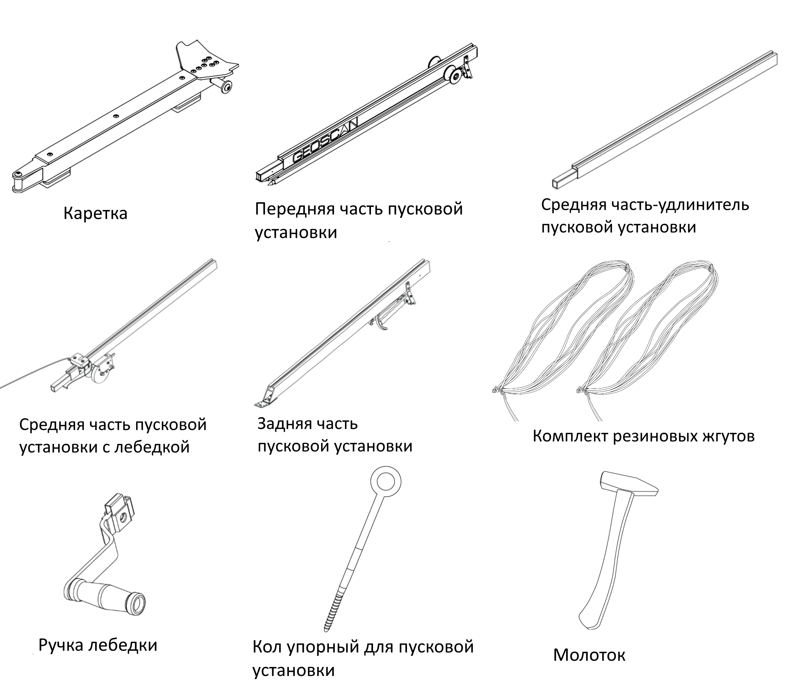

Пусковая установка
=====================

Пусковая установка нужна для стартового разгона БВС до скорости, на которой оно может поддерживать устойчивый полёт.

Узлы, детали и принадлежности
---------------------------------

Полный комплект пусковой установки:

Сборка
----------

Извлеките детали пусковой установки из транспортировочной сумки.

.. figure:: _static/_images/catapult1.png
   :align: center
   :width: 400

   Разложите опорные стойки. Убедитесь, что они надежно закреплены подпружиненными защелками. Чтобы сложить стойки, оттяните защелки вверх.

.. figure:: _static/_images/catapult2.png
   :align: center
   :width: 400

   Присоедините среднюю часть-удлинитель к передней части пусковой установки.

.. figure:: _static/_images/catapult3.png
   :align: center
   :width: 400

   Присоедините среднюю часть пусковой установки с лебедкой.

.. figure:: _static/_images/catapult4.png
   :align: center
   :width: 400

   Разложите опорные стойки задней части пусковой установки.

.. figure:: _static/_images/catapult6.png
   :align: center
   :width: 400

   Присоедините заднюю часть пусковой установки. Вставьте фиксирующий штифт в отверстие в соединении средней и задней частей пусковой установки.

.. attention:: Запуск БВС разрешен строго против ветра. Категорически запрещается производить запуск БВС по ветру. Невыполнение данного требования может привезти к падению БВС или к столкновению его с препятствиями, поскольку БВС не сможет набрать высоту. В штилевых условиях добавьте на каждую сторону дополнительный виток резиновых жгутов из комплекта ЗИП.

* Установите пусковую установку на ровной поверхности так, чтобы запуск БВС происходил против ветра.

* Убедитесь, что пусковая установка устойчиво стоит на земле, а ее направляющая не имеет крена. При необходимости заглубите одну из опор для выравнивания конструкции.

* Установите и забейте упорный кол, чтобы предотвратить смещение пусковой установки при запуске БВС.

.. attention:: При запуске БВС рывок резиновых жгутов приводит к подбрасыванию задней части пусковой установки. Чтобы надежно закрепить пусковую установку, забивайте кол на всю длину, добиваясь полной неподвижности задних опорных стоек. Забивая кол, следите за тем, чтобы не деформировать заднюю часть пусковой установки.

.. figure:: _static/_images/catapult9.png
   :align: center
   :width: 400

   Установите каретку на направляющую пусковой установки со стороны передней части так, чтобы направляющие каретки скользили по рельсам.

* Прокатите каретку по рельсам вниз до ее фиксации в замке (должно быть два щелчка).

.. note:: Убедитесь, что каретка свободно скользит по рельсам, не цепляясь на стыках частей пусковой установки. Осуществляйте проверку свободного движения каретки перед каждым запуском БВС.

.. figure:: _static/_images/catapult8.png
   :align: center
   :width: 400

   Вставьте предохранительный штифт в пусковой механизм. Отпустите стопор лебедки и размотайте натяжной трос.

* Возьмите резиновые жгуты, расправьте кольца, убедитесь, что жгуты не перехлестнуты.

 
.. figure:: _static/_images/catapult10.png
   :align: center
   :width: 250

   Сложите кольца резиновых жгутов так, чтобы на одной стороне находился карабин, а на второй кольцо из синтетического троса. Из кольца сделайте петлю и зацепите каретку.

* Второй конец резинового жгута соедините с концом натяжного троса с помощью карабина. Натяжной трос должен проходить через ролик. Карабин обязательно должен быть замуфтован.

* Аналогично присоедините второй резиновый жгут.

.. figure:: _static/_images/catapult11.png
   :align: center
   :width: 400

   Наденьте ручку лебедки на ось и надавите вдоль оси до щелчка фиксатора.

Подготовка пусковой установки к запуску БВС
---------------------------------------------

.. attention:: Чтобы продлить срок службы жгутов и обеспечить безопасность работ, натягивайте жгуты непосредственно перед стартом, после проведения предстартовой подготовки.

Вращая ручку лебедки, натяните резиновые жгуты. Особое внимание следует обратить на карабины во время их прохождения через ролики. При попадании жгута между роликом и направляющей или срыве с ролика необходимо прекратить натяжение жгутов. Сорвавшийся жгут нужно уложить на ролик, после чего можно продолжить взводить пусковой установки. 

Когда карабины, за которые зацеплены жгуты, будут напротив маркера "STOP", выгравированного на пусковой части установки, натяжение можно прекратить.

Теперь можно установить БВС на пусковую установку.

.. attention:: Убедитесь что резиновый жгут складывает воздушный винт, а лопасти винта сложены в горизонтальной плоскости.

Правила обращения с резиновыми жгутами
--------------------------------------

* Регулярно проверяйте состояние резиновых жгутов. При обнаружении трещин и потертостей замените поврежденное кольцо на запасное из комплекта ЗИП.
* Не держите резиновые жгуты в натянутом состоянии длительное время. Натягивайте жгуты непосредственно пере установкой БВС на пусковую установку.
* После запуска БВС снимите резиновые жгуты с поворотных роликов. Для этого одной рукой придерживая ручку лебедки, второй снимите стопор лебедки, и плавно разматывайте натяжной трос. После этого можно снять жгуты с пусковой установки, отсоединив карабин от троса и петлю от каретки. 
* В теплое время года не допускайте длительного нахождения резиновых жгутов под прямыми солнечными лучами. 
* В холодное время года не допускайте замерзания резиновых жгутов. Держите их в теплом месте до установки на пусковую установку и натягивайте непосредственно перед запуском. После запуска БВС немедленно снимите жгуты с пусковой установки и уберите в теплое место. 
  
