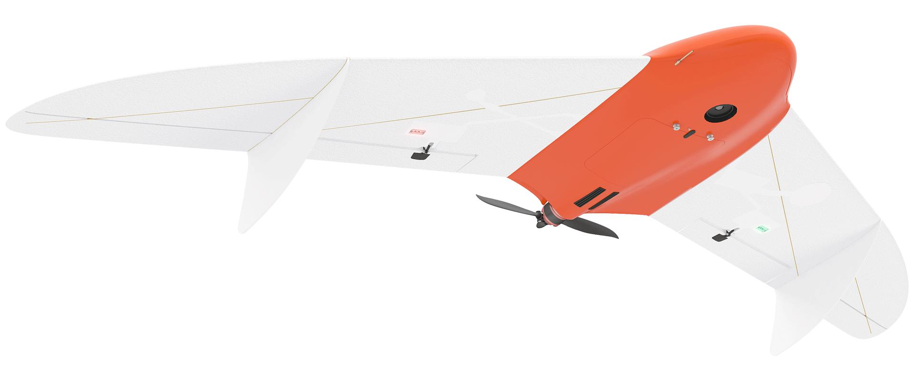

.. 201-doc documentation master file, created by
   sphinx-quickstart on Fri Dec 21 11:13:03 2018.
   You can adapt this file completely to your liking, but it should at least
   contain the root `toctree` directive.

Сборка и эксплуатация комплекса "Геоскан 201"
=====================================================

`На сайт Geoscan`_
--------------------------
.. _На сайт Geoscan: https://www.geoscan.aero/ru/products/geoscan201

Общие сведения
-----------------------

«Геоскан 201» – это аэрофотосъемочный комплекс, включающий в себя беспилотное воздушное судно (БВС) типа «летающее крыло», пусковую установку – катапульту и наземную станцию управления.

**Назначение**

Аэрофотосъемочный комплекс «Геоcкан 201» предназначен для получения геопривязанных фотографий объектов и площадной аэрофотосъёмки.

**Область применения**

Полученные с использованием комплекса материалы могут использоваться для:

* создания ортофотопланов масштаба 1:500 – 1:2000
* трехмерного моделирования участка местности 
* создания карт высот местности 
* вычисления объемов пород в карьерах и насыпных объектах
* обследования состояния объектов инфраструктуры, дорожного полотна
* инвентаризации лесов и посевов
* оценки ущерба и планировании аварийно-спасательных работ при ЧС, таких как наводнения, оползни и пожары

.. csv-table:: **Технические характеристики**
   :header: "Параметр", "Значение"

   "Тип БВС", "летающее крыло"
   "Скорость полета (воздушная)", 30-140 км/ч
   "Максимальная взлетная масса", "8,5 кг"
   "Максимальная масса полезной нагрузки", "1,5 кг"
   "Площадь фотосъемки за один полет","7-22 км2"
   "Допустимая скорость ветра","12 м/с"
   "Размах крыла", "2,22 м"
   "Минимальная безопасная высота полета","100 м"
   "Максимальная высота полета","4000 м"
   "Двигатель","электрический, бесколлекторный"
   "Аккумуляторная батарея","LiPo 5S AP 1370170"
   "Время подготовки к взлету","10 мин"
   "Продолжительность полета", "до 3 ч"
   "Максимальная протяженность маршрута","210 км"
   "Взлет","с катапульты"
   "Посадка","на парашюте, в автоматическом режиме"
   "Рабочий диапазон температур:",""
   "  с АКБ Стандарт","от -20 до +40 °С"
   "  с АКБ Арктика","от -40 до +20 °С"

Комплект поставки
---------------------

* Полезная нагрузка: *

	* модернизированный фотоаппарат Sony RX1 
	* модернизированный фотоаппарат Sony A6000 
	* модернизированный фотоаппарат Sony A6000 NIR 

* GNSS Topcon B111 *
* Наземная станция управления
* Радиомодем наземный
* Стойка для модема
* Зарядное устройство
* Катапульта
* 2 Транспортных контейнера
* Чехол катапульты
* Раскладная подставка для сборки БВС
* Транспортировочная подставка для фюзеляжа
* Комплект ЗиП
* Комплект документации

*Может изменяться в зависимости от комплектации заказа

Техническое обслуживание
-------------------------

После выполнения 80 полетов рекомендуется отправить БВС на завод-изготовитель для проведения проверки и технического обслуживания.

Хранение

Комплекс «Геоскан 201» следует хранить в транспортных контейнерах (катапульту – в чехле) 

.. toctree::
   :maxdepth: 2
   :caption: Содержание:

   precautions
   uav
   nsu
   catapult
   camera

