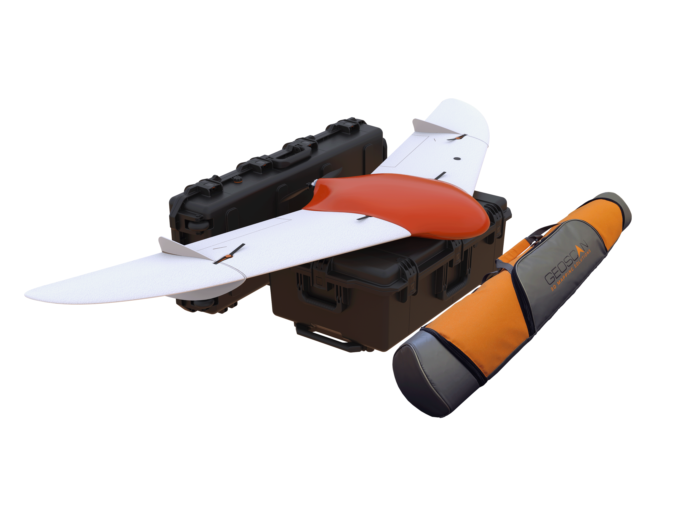

.. 201-doc documentation master file, created by
   sphinx-quickstart on Fri Dec 21 11:13:03 2018.
   You can adapt this file completely to your liking, but it should at least
   contain the root `toctree` directive.

Сборка и эксплуатация комплекса "Геоскан 201"
================================================

`На сайт Geoscan`_ 

.. _На сайт Geoscan: https://www.geoscan.aero/

**Общие сведения**

«Геоскан 201» - это аэрофотосъемочный комплекс, включающий в себя беспилотное воздушное судно (БВС) типа «летающее крыло», пусковую установку и наземную станцию управления.

**Назначение**

Аэрофотосъемочный комплекс «Геоскан 201» предназначен для получения геопривязанных фотографий отдельных объектов, площадной и линейной аэрофотосъёмки.

**Область применения**

Полученные с использованием комплекса материалы могут использоваться для:

* создания ортофотопланов масштаба 1:500 - 1:2000;
* трехмерного моделирования участка местности;
* создания карт высот местности; 
* вычисления объемов пород в карьерах и насыпных объектах;
* обследования состояния объектов инфраструктуры, дорожного полотна;
* инвентаризации лесов и посевов;
* оценки ущерба и планирования аварийно-спасательных работ при ЧС, таких как наводнения, оползни и пожары.

.. csv-table:: **Технические характеристики**
   :header: "Параметр", "Значение"

   "Тип БВС", "летающее крыло"
   "Скорость полета (воздушная)", 64 - 130 км/ч
   "Максимальная взлетная масса", "8,5 кг"
   "Максимальная масса полезной нагрузки", "1,5 кг"
   "Площадь фотосъемки за один полет","7 - 22 км²"
   "Допустимая скорость ветра","12 м/с"
   "Размах крыла", "2,22 м"
   "Минимальная безопасная высота полета","100 м"
   "Максимальная высота полета","4000 м"
   "Двигатель","электрический, бесколлекторный"
   "Аккумуляторная батарея","LiPo 18,5 В"
   "Время подготовки к взлету","10 мин"
   "Продолжительность полета", "до 180 мин"
   "Максимальная протяженность маршрута","210 км"
   "Взлет","с пусковой установки"
   "Посадка","на парашюте, в автоматическом режиме"
   "Рабочий диапазон температур:",""
   "  с АКБ Стандарт","от -20 до +40 °С"
   "  с АКБ Арктика","от -40 до +20 °С"

**Комплект поставки**

* БВС Геоскан 201
* Наземная станция управления
* Модем КРЛ
* Стойка для модема
* Зарядное устройство для АКБ
* Пусковая установка в транспортировочной сумке
* Транспортировочный контейнер БВС
* Транспортировочный контейнер НСУ
* Раскладная подставка для сборки БВС
* Ложемент для фюзеляжа
* Комплект ЗИП
* Комплект документации
* GNSS Topcon B111 `*`
* Фотоаппарат : `*`

   * модернизированный фотоаппарат Sony RX1;
   * модернизированный фотоаппарат Sony A6000;
   * модернизированный фотоаппарат Sony A6000 NIR. 

`*` - *Полезная нагрузка зависит от комплектации заказа*

**Обслуживание**

После каждого полета осматривайте БВС на предмет повреждений.

В случае повреждения лопастей винта или килей вы можете заменить их самостоятельно, используя запасные части и инструменты из комплекта.

При выявлении конструкционных повреждений планера или систем необходимо обратиться в службу `технической поддержки`_. 

.. _технической поддержки: https://www.geoscan.aero/ru/support.

После выполнения 80 полетов рекомендуется отправить БВС на завод-изготовитель для проверки и технического обслуживания.

**Хранение**

Комплекс Геоскан 201 (без аккумуляторных батарей) рекомендуется хранить в транспортировочном кейсе (пусковую установку - в сумке) в сухих помещениях при температуре от 5 до 25 °С и относительной влажности не более 80%, без конденсации. Срок хранения - 2 года.

Аккумуляторные батареи хранить в сухом прохладном месте, исключающем воздействие прямых солнечных лучей, при температуре от 5 до 25 °С и относительной влажности не более 80%, без конденсации. Оптимальная температура - от 5 до 10 °С. Оптимальный уровень напряжения АКБ при помещении батареи на хранение: 19 В (Подробнее см. раздел Зарядная станция и АКБ). Срок хранения - 1 год.

.. toctree::
   :maxdepth: 2
   :caption: Содержание:

   reference
   precautions
   uav
   nsu
   catapult
   camera
   charger
   planner
   launch
   dissassemble