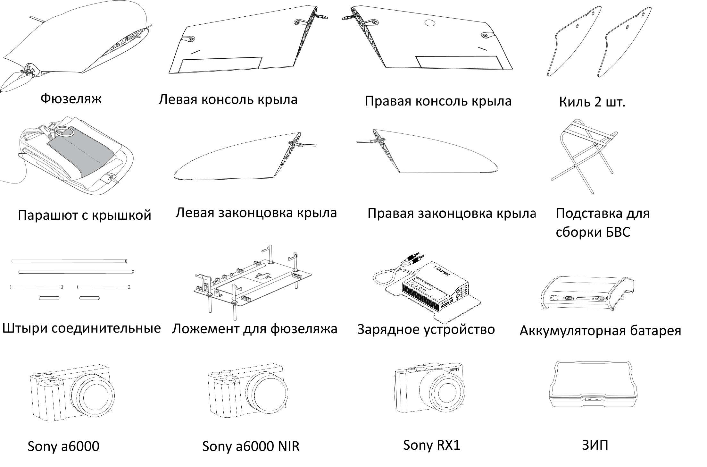

БВС
============

Узлы и детали 
---------------------------

Полный комплект деталей для сборки БВС:

Сборка 
-------------

Откройте транспортировочный контейнер, достаньте раскладную подставку для сборки планера и установите ее на ровной поверхности. Достаньте ложемент с фюзеляжем и установите рядом. Извлеките фюзеляж из ложемента и надежно установите его на раскладную подставку для сборки.

.. figure:: _static/_images/asmbl1.png
   :align: center
   :width: 300
   :alt: Снятие крышки фюзеляжа.

   Снимите крышку фюзеляжа, отжав защелку, как показано на рисунке.

.. figure:: _static/_images/asmbl2.png
   :align: center
   :width: 300
   :alt: Фюзеляж, вид «сбоку-сверху»
   
   Извлеките из гнезд ложемента соединительные штыри 610 мм и установите в отверстия в фюзеляже.

.. figure:: _static/_images/asmbl3.png
   :align: center
   :width: 300
   :alt: Консоль крыла 

   Аккуратно насадите консоль крыла на соединительные штыри. Оставьте между консолью крыла и фюзеляжем зазор для подключения разъема. Подключите разъем к соответствующему гнезду. Разъем имеет ключ.

 
.. figure:: _static/_images/asmbl4.png
   :align: center
   :width: 300
   :alt: Врезка – застегнутый резиновый фиксатор

   Плавно продвиньте консоль крыла к фюзеляжу до упора. Застегните резиновый фиксатор. Аналогично установите другую консоль.

.. figure:: _static/_images/asmbl5.png
   :align: center
   :width: 300
   :alt: В свободный конец консоли вставлены средний и короткий штыри 

   Вставьте средний и короткий соединительные штыри в отверстия консоли крыла, как показано на рисунке. Наденьте на соединительные штыри киль, затем наденьте на соединительные штыри законцовку крыла, аккуратно продвиньте ее до упора, застегните резиновый фиксатор.

.. figure:: _static/_images/asmbl9.png
   :align: center
   :width: 300
   :alt: Врезка – подключение разъемов фотоаппарата

   Поместите фотоаппарат в ложемент и зафиксируйте эластичным фиксатором.Подключите разъем фотоаппарата как показано на рисунке. Для проверки настроек фотоаппарата или для извлечения из фотоаппарата карты памяти снимите эластичный фиксатор и извлеките фотоаппарат из ложемента. Отсоединять разъем фотоаппарата при этом не требуется.

.. figure:: _static/_images/asmbl10.png
   :align: center
   :width: 300
   :alt: Установка АКБ

   Установите АКБ, для этого установите передние упоры в пазы и задвиньте АКБ вперед, далее отпустите АКБ так, чтобы вторая пара упоров защелкнулась в направляющей. Для извлечения АКБ отожмите обе защелки в стороны.

.. figure:: _static/_images/asmbl11.png
   :align: center
   :width: 300
   :alt: Закрывание крышки фюзеляжа.

   Закройте крышку фюзеляжа и убедитесь, что фиксирующая защелка удерживает её на месте.

Парашютная система
----------------------

Составные части парашютной системы:
 
.. figure:: _static/_images/para1.png
   :align: center
   :width: 300

   1 – крышка парашютного отсека, выполняющая функцию вытяжного парашюта; 
   2 – купол парашюта; 
   3 – карманы для укладки строп; 
   4 – стропы; 
   5 – кольцо-слайдер, предназначенное для замедления раскрытия купола; 
   6 – длинный фал; 
   7 – короткий фал с кольцом системы отцепа. 

.. attention:: Перед укладкой парашюта убедитесь, что купол парашюта, стропы и крепления строп к куполу не повреждены, не имеют надрывов и разрезов. Купол и стропы должны быть сухими, на них не должно быть бензиновых или масляных пятен. В случае если укладка парашюта производилась более чем за 10 суток до вылета, или комплекс перевозился авиационным транспортом, разверните парашют и уложите его заново.

**Порядок укладки парашюта**

* Проверьте состояние парашюта.
* Убедитесь, что стропы не запутаны, а крышка парашютного отсека находится снаружи купола.
* Следите, чтобы в процессе укладки парашюта стропы не путались.
* Контролируйте положение карманов для строп, они должны оставаться на наружной стороне сложенного купола. 

.. figure:: _static/_images/para2.png 
   :align: center
   :width: 300

   Расправьте купол и, совмещая вырезы друг с другом, сложите его пополам.

.. figure:: _static/_images/para3.png
   :align: center
   :width: 300

   Повторно сложите купол пополам и выровняйте края.

.. figure:: _static/_images/para4.png
   :align: center
   :width: 300

   В результате стропы должны собраться в 4 пучка по 4 стропы в каждом. 

.. figure:: _static/_images/para5.png
   :align: center
   :width: 300

   Еще раз сложите купол пополам так, чтобы карманы для укладки строп оказались сверху.
   
 
.. figure:: _static/_images/para6.png
   :align: center
   :width: 300

   Аккуратно сложите купол «гармошкой», как показано на рисунке.

.. figure:: _static/_images/para8.png
   :align: center
   :width: 300

   Убедитесь, что стропы не перекручены и не перехлестнуты. При необходимости расправьте стропы. Уложите стропы в карман. Для этого отмерьте длину пучка строп, превышающую глубину кармана. 

.. figure:: _static/_images/para7.png
   :align: center
   :width: 300

   Сложите пучок пополам и протяните в карман так, чтобы перегиб пучка на несколько сантиметров выступал с противоположной стороны кармана.

.. figure:: _static/_images/para9.png
   :align: center
   :width: 300

   При необходимости устраните слабину строп у края купола, подтянув их за перегиб с противоположной стороны пучка. Передвиньте стопорное кольцо к куполу.Заправьте оставшуюся часть строп в свободный карман купола. Для этого сложите оставшуюся часть пополам и проденьте в карман так, чтобы оплетка на узле соединения строп с фалом касалась кармана. После укладки оставшейся части строп в карман купола кольцо должно находиться между витками строп.

.. figure:: _static/_images/para10.png
   :align: center
   :width: 300

   Сложите купол «гармошкой», как показано на рисунке.

**Порядок установки парашюта на БВС**

* Переверните БВС, чтобы парашютный отсек оказался сверху.
* Возьмите в руки карабин подвеса и расправьте тросики.

.. figure:: _static/_images/param1.png
   :align: center
   :width: 300

   Проденьте конец короткого фала парашюта в карабин подвеса со стороны передней части БВС.

    
.. figure:: _static/_images/param2.png
   :align: center
   :width: 300

   Проденьте конец короткого фала через кольцо системы отцепа со стороны двигателя. 

.. figure:: _static/_images/param3.png
   :align: center
   :width: 300

   Пропустите конец короткого фала через отверстие системы отцепа и защелкните петлю на его конце между половинками замка.
   Внимание! Будьте внимательны при переноске и установке БВС на пусковую установку. Случайное нажатие на язычок системы отцепа может привести к открытию замка системы отцепа и, как следствие, к преждевременному отделению парашюта при посадке БВС.

.. note:: Убедитесь, что замок системы отцепа надежно защелкнут. Для этого  поднимите БВС за фал парашюта и сделайте несколько коротких резких рывков вверх.

.. figure:: _static/_images/param4.png
   :align: center
   :width: 300

   Аккуратно уложите тросики подвесной системы и фал на дно парашютного отсека. Уложите сверху сложенный парашют так, чтобы основание парашюта с кольцом оказалось на дне парашютного отсека.

.. figure:: _static/_images/param5.png
   :align: center
   :width: 300

   Вставьте выступ на задней части крышки парашютного отсека в паз на корпусе БВС и опустите крышку. При необходимости заправьте края купола или фал под крышку.

.. figure:: _static/_images/param6.png
   :align: center
   :width: 300

   Плотно прижмите крышку к фюзеляжу БВС и зафиксируйте, аккуратно повернув поводок машинки отцепа.

Проверьте, что крышка парашютного отсека свободно открывается и закрывается. Для этого поверните поводок машинки отцепа в сторону и приподнимите крышку вверх.

Стропа крепления крышки к парашюту не должна западать или цепляться за подкрепляющий штырь крышки. Убедитесь, что крышка свободно открывается и закрывается, а купол сложенного парашюта не попадает в места прилегания крышки к фюзеляжу. Закройте крышку, прижав ее и сдвинув поводок машинки отцепа.

.. attention:: Категорически запрещается поворачивать поводок машинки парашютного отсека рукой при включенном электропитании БВС.

